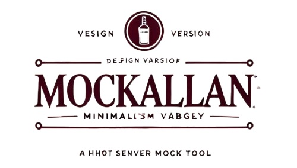

[](https://pypi.org/project/mockallan/) [](https://pypi.org/project/mockallan/) [](https://github.com/david-domz/mockallan/actions/workflows/python-package.yml) [](https://sonarcloud.io/summary/new_code?id=david-domz_mockallan)

Mockallan is a lightweight HTTP server mock for CI and test environments.


## Highlights

- Command line interface for CI and test environments.

- Configurable default and per endpoint responses.

- Robust assertion capabilities.

- Request body matching in assertions based on
  - Text matching
  - JSON message matching
  - JSON schema validation
  - XML schema validation
  - Regular expression matching

- Concise codebase.

- API naming inspired by the `Mock` class from the standard Python `unittest.mock` library.

## Requirements

- Python >= 3.8

## Installation

Mockallan is available on [PyPI](https://pypi.org/project/mockallan/). Install it using pip.

```bash
pip install mockallan
```

Creating and activating a virtual environment first is recommended. Alternatively, see [mockallan-docker](https://github.com/david-domz/mockallan-docker) repository to run Mockallan in a docker container. 

## Getting Started


1) Run `mockallan.py`

```bash
python mockallan.py
Listening on 0.0.0.0:8080
```

2) Run the system under test.

Use `curl` to simulate a request performed by the system under test. For example, if we expect our system under test to perform a `POST /orders/order_e2b9/products`, we would run the following `curl` command.

```bash
curl -s -X POST http://localhost:8080/orders/order_e2b9/products --data '{
	"product_id": "foo",
	"description": "bar",
	"amount": 1
}'
```

Mockallan will reply with the factory default response.

```json
{
	"status": "200",
	"message": "This is mockallan's factory default response."
}
```

3) Make assertions on the expected request.

```bash
curl -X GET "http://localhost:8080/assert-called?method=POST&path=/orders/order_e2b9/products"
```

If the assertion request returns 200 then everything went well.

```json
{
	"status": 200,
	"type": "assertion-success",
	"title": "Assertion request GET /assert-called succeeded",
	"detail": "POST /orders/order_e2b9/products called 1 times."
}
```

If it returns 409 then the assertion failed and the system under test did not behave as expected.

```json
{
	"status": 409,
	"type": "assertion-error",
	"title": "Assertion request GET /assert-called failed",
	"detail": "Expected POST /orders/order_e2b9/products to be called 1 times. Called 0 times."
}
```

## Using Configurable Stub Responses

1) Create a stub configuration JSON file or use the `stub_config.json` provided in this repository.

E.g.
```json
{
	"endpoints": [
		{
			"request": {
				"method": "POST",
				"path": "/orders/order_e2b9/products"
			},
			"response": {
				"status_code": 200,
				"headers": {
					"Content-type": "application/json"
				},
				"body": {
					"status": "200",
					"message": "This is the configured response for POST /orders/order_e2b9/products"
				}
			}
		}
	]
}
```

2) Run `mockallan.py` and provide the JSON file.

```bash
python mockallan.py -c stub_config.json
```

3) Run the system under test or simulate the request performed by it. The mock will reply with the configured response for `POST /orders/order_e2b9/products`.

4) Make assertions on the expected request.

```bash
curl -X GET "http://localhost:8080/assert-called?method=POST&path=/orders/order_e2b9/products"
```

If the assertion request returns 200 then everything went fine. If it returns 409 then the assertion failed and the system under test did not behave as expected.


## Using `/assert-called-with` And `/assert-called-once-with`

Additional validation options are available using the `POST /assert-called-with` and `POST /assert-called-once-with` endpoints. The body message provided in these requests corresponds to a
- Text message
- JSON message
- JSON schema
- XML schema
- or a regular expression string

to match as shown in the following sections.


### JSON Schema Validation Assertions

Add `Content-Type: application/schema+json` to the `POST /assert-called-with` or `POST /assert-called-once-with` request and place the JSON schema message in the body.

E.g. 

```bash
curl -X POST --header 'Content-Type: application/json+schema'	\
	"http://localhost:8080/assert-called-with?method=POST&path=/orders/order_e2b9/products"	\
	--data '{
		"$schema": "http://json-schema.org/draft-07/schema#",
		"type": "object",
		"properties": {
			"orderNumber": {
				"type": "string"
			},
			"products": {
				"type": "array",
				"items": {
					"type": "object",
					"properties": {
						"productId": {
							"type": "string"
						},
						"quantity": {
							"type": "integer",
							"minimum": 1
						}
					},
					"required": ["productId", "quantity"]
				}
			}
		},
		"required": ["orderNumber", "products"]
	}'
```

### XML Schema Validation Assertions

Add `Content-Type: application/xml` to the `POST /assert-called-with` or `POST /assert-called-once-with` request and place the XML schema message in the body.

E.g.

```bash
curl -X POST --header 'Content-Type: application/xml'	\
	"http://localhost:8080/assert-called-with?method=POST&path=/orders/order_e2b9/products"	\
	--data '<?xml version="1.0" encoding="UTF-8"?>
    <xs:schema xmlns:xs="http://www.w3.org/2001/XMLSchema">
        <xs:element name="order">
            <xs:complexType>
                <xs:sequence>
                    <xs:element name="orderNumber" type="xs:string"/>
                    <xs:element name="products" type="productListType"/>
                </xs:sequence>
            </xs:complexType>
        </xs:element>
        <xs:complexType name="productListType">
            <xs:sequence>
                <xs:element name="product" type="productType" minOccurs="0" maxOccurs="unbounded"/>
            </xs:sequence>
        </xs:complexType>
        <xs:complexType name="productType">
            <xs:sequence>
                <xs:element name="productId" type="xs:string"/>
                <xs:element name="quantity" type="xs:integer"/>
            </xs:sequence>
        </xs:complexType>
    </xs:schema>'
```

### Regex Validation Assertions

Add the custom header `X-Mockallan-Validator: regex` to the `POST /assert-called-with` or `POST /assert-called-once-with` request and place the regular expression in the body. 

E.g.

```bash
curl -X POST --header 'X-Mockallan-Validator: regex'	\
	"http://localhost:8080/assert-called-with?method=POST&path=/orders/order_e2b9/products"	\
	--data '{"orderNumber":"\w+","products":\[\{"productId":"\w+","quantity":\d+}(,\{"productId":"\w+","quantity":\d+\})*\]}'
```

<!-- ## Stub Configuration JSON

The Stub Configuration JSON format configures mockallan responses.

### Stub Configuration Example


```json
{
	"defaults": {
		"response": {
			"status_code": 200,
			"headers": {
				"Content-Type": "application/json"
			},
			"body": {
				"status": 200,
				"message": "This is the default response configured in stub_config.json"
			}
		}
	},
	"endpoints": [
		{
			"request": {
				"method": "GET"
				"path": "/orders/order_e2b9/products"
			},
			"response": {
				"status_code": 200
				"headers": {
					"Content-type": "application/json"
				},
				"body": {
					"status": 200,
					"message": "This is the configured response for GET /orders/order_e2b9/products"
				}
			}
		}
	]
}
``` -->

## Stub Configuration API

The Stub Configuration API allows the test client to configure the mock at runtime.

|Method|Path|Query Params|Request Body|Status|Response Body|
|-|-|-|-|-|-|
|PUT|/configure|-|JSON stub configuration|204; 400|-|
|GET|/configure|-|-|200|JSON stub configuration|


## Assertion API

The Assertion API allows for the validation of expected requests.

|Method|Path|Query Params|Request Body|Status|Response Body|
|-|-|-|-|-|-|
|GET|/assert-called|method, path|-|200 OK; 400; 409|Assertion success or error message|
|GET|/assert-called-once|method, path|-|200 OK; 400; 409|Assertion success or error message|
|POST|/assert-called-with|method, path|JSON object, JSON schema, XML schema or regex|200 OK; 400; 409|Assertion success or error message|
|POST|/assert-called-once-with|method, path|JSON object, JSON schema, XML schema, regex or message body|200 OK; 400; 409|Assertion success or error message|
|GET|/request-body|-|-|200 OK; 409|The request body that the mock was last called with|
|GET|/request-body-list|-|-|200 OK|List of all the requests made to the mock in sequence|
|GET|/request-count|-|-|200 OK|Request count|


## Feedback

Please submit feedback, ideas and bug reports by [creating an issue](https://github.com/david-domz/mockallan/issues) or [startint a new discussion](https://github.com/david-domz/mockallan/discussions).

Feel free to give this repository a ⭐ if you find it helpful.

## License

This project is licensed under the terms of the MIT license.


## Related Projects

- [mockallan-docker](https://github.com/david-domz/mockallan-docker) - Containerized lightweight HTTP server mock.
- [mockallan-python-client](https://github.com/david-domz/mockallan-python-client) - Mockallan python client class.
