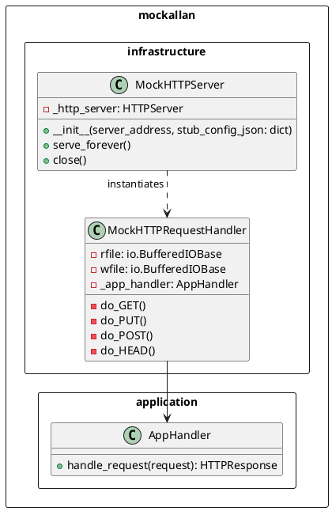
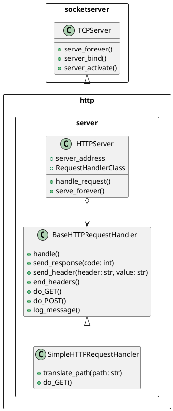
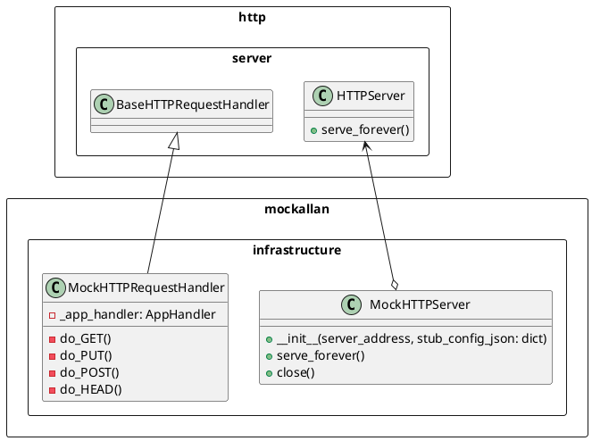
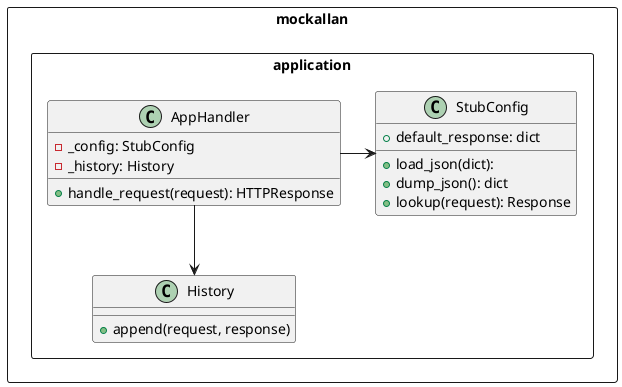
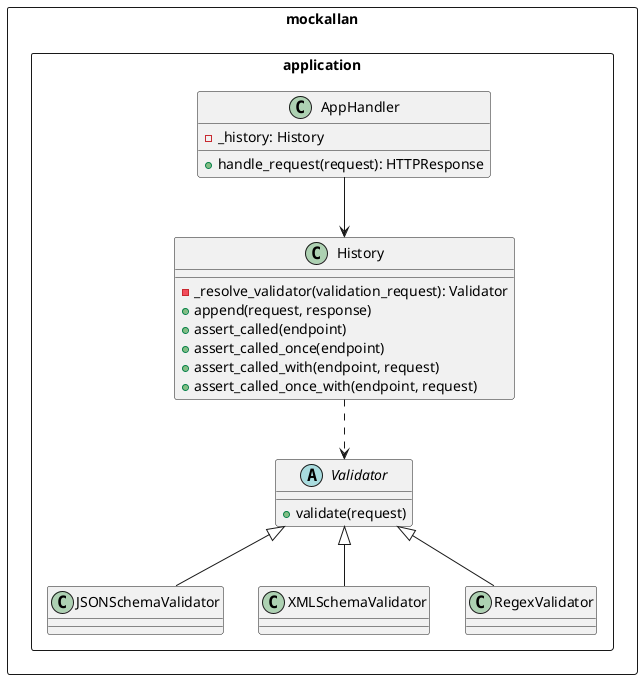

# Mockallan Architecture

NOTE: Diagrams in PlantUML. Clone or download the repo and use the PlantUML VSCode extension (extension ID: jebbs.plantuml) to display them or visit https://plantuml.com/ for more information.

## Table of Contents

- [Mockallan Architecture](#mockallan-architecture)
	- [Table of Contents](#table-of-contents)
	- [Introduction](#introduction)
	- [Architecture Overview](#architecture-overview)
	- [Infrastructure Layer](#infrastructure-layer)
		- [The `http.server` Python Package](#the-httpserver-python-package)
		- [Mockallan Infrastructure Classes](#mockallan-infrastructure-classes)
	- [Application Layer](#application-layer)
		- [Software Under Test Requests](#software-under-test-requests)
		- [Stub Configuration Requests](#stub-configuration-requests)
		- [Assertion Requests](#assertion-requests)
	- [Conclusion](#conclusion)


## Introduction

This document is intended for developers, testers and anyone curious about the Mockallan architecture.

## Architecture Overview

Mockallan is based on a minimal Clean Architecture with 2 layers: infrastructure and application.

The infrastructure layer consists of the `MockHTTPServer` and `MockHTTPRequestHandler` classes, which handle the low-level HTTP request processing.

Infrastructure classes depend on the standard Python `http.server` package, which provides the `HTTPServer` and `BaseHTTPRequestHandler` classes.

The application layer contains the core business logic. This layer is decoupled from the infrastructure code.




## Infrastructure Layer

### The `http.server` Python Package

The **`http.server`** module is part of Python's standard library and provides the essential tools for building HTTP servers:

- `HTTPServer`: Manages the socket connection and routes incoming HTTP requests to request handlers.
- `BaseHTTPRequestHandler`: Processes incoming requests, handling methods such as `GET`, `POST` and sending back appropriate HTTP responses.
- `SimpleHTTPRequestHandler`: Extends `BaseHTTPRequestHandler` to provide functionality for serving static files from the file system. This class is not used in Mockallan, but a custom `MockHTTPRequestHandler` has been implemented instead.

When a server is started by running `python -m http.server`, an `HTTPServer` object is created and listens for incoming requests, which are handled by the `SimpleHTTPRequestHandler` handler class, which decides how to respond to clients.




### Mockallan Infrastructure Classes

Mockallan is built on top of the `http.server` package.




## Application Layer

The application layer is responsible for processing requests and determining how the mock server should respond. This layer contains the business logic that defines which response should be returned for each incoming request.

More classes derived from `Validator` can be added to extend the request validation.



### Software Under Test Requests

```plantuml

-> MockHTTPRequestHandler : do_POST()
MockHTTPRequestHandler -> AppHandler : handle_request(\n request\n)
AppHandler -> StubConfig : lookup(\n request\n)
AppHandler <- StubConfig : response
AppHandler -> History : append(\n request,\n response\n)
MockHTTPRequestHandler <- AppHandler : response
<- MockHTTPRequestHandler

```

### Stub Configuration Requests

```plantuml

-> MockHTTPRequestHandler : do_PUT()
MockHTTPRequestHandler -> AppHandler : handle_request(\n request\n)
AppHandler -> StubConfig : load_json(\n request.body\n)
AppHandler <- StubConfig
MockHTTPRequestHandler <- AppHandler : 204 OK
<- MockHTTPRequestHandler : 204 OK

```


### Assertion Requests



## Conclusion

Mockallan has been designed with flexibility and simplicity in mind.

Using Python's standard `http.server` package, it provides a lightweight and efficient HTTP server for test environments.

It separates its infrastructure concerns from the core application logic, making it maintainable, testable and easily extensible for future enhancements.
